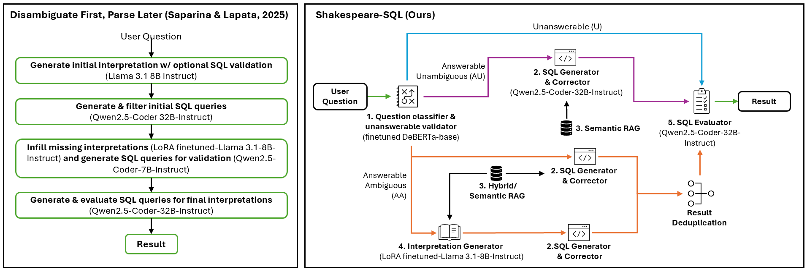

# **Shakespeare-SQL**: "To RAG or Not to RAG, That Is the Question: Effective Text-to-SQL Generation Under Ambiguity" 

<p align="center">
  <br>
  <sub>Photo by Stock Montage/Getty Images - Retrieved from <a href="https://www.poetryfoundation.org/poets/william-shakespeare">The Poetry Foundation</a></sub>
</p>

Shakespeare-SQL is an agentic Text-to-SQL ambiguity resolution framework with integrated question classification (DeBERTa), retrieval-augmented generation (RAG), and LoRA-based interpretation validation.



## Repository Structure

```
shakespear-sql/
├── agents/
│   └── unified_agent.py        # Core agent: routing, SQL generation, evaluation
├── evaluation/                 # SQL execution and scoring utilities
│   ├── exceptions.py
│   ├── metric_utils.py
│   ├── metrics.py
│   ├── model_interface.py
│   ├── model_utils.py
│   ├── output_parsers.py
│   ├── resplit_ambrosia.py
│   └── sql_generation.py
├── finetuning_scripts/         # DeBERTa and Llama GRPO training scripts
│   ├── train_classifier_diverse.py
│   └── train_llama_grpo_curriculum.py
├── rag/                        # RAG vector DB, prompts, retrieval utilities
│   ├── ambiguity_type_classifier_lda.py
│   ├── evaluation_ambrosia_prompts_authors.py
│   ├── hybrid_ambiguity_retrieval.py
│   ├── rag_vectordb.py
│   └── sql_parsing_utils.py
├── models/                     # Fine-tuned model checkpoints (included in repo)
│   ├── deberta-v3-base_diverse_20251115_160058/   # DeBERTa question classifier
│   └── llama_grpo_curriculum/                     # LoRA adapters (one folder per curriculum run)
│       ├── curriculum_claude-sonnet-4_5-20251123_055234/final_model/
│       ├── curriculum_gpt-4_1-2025-04-14_20260214_103006/final_model/
│       ├── curriculum_gpt-5_2-2025-12-11_20260214_053301/final_model/
│       └── curriculum_Qwen-Qwen3-235B-A22B-Instruct-2507-FP8_20260214_153240/final_model/
├── test_framework.py           # Main evaluation entry point
├── run_ablation_study.sh       # 8-condition ablation (RAG × LoRA × dataset)
├── run_grpo_curriculum_adapter_study.sh  # Test different GRPO curriculum adapters
├── start_qwen_vllm.sh          # Start Qwen2.5-Coder-32B vLLM server
├── start_llama_vllm.sh         # Start Llama-3.1-8B vLLM server
├── shakespeare-sql.png         # Architecture diagram
├── requirements.txt
├── data/                       # Dataset files, including Ambrosia+ - follow README.md instructions
└── outputs/                    # Evaluation results (created at runtime)
```

## Prerequisites

### Hardware

- **2 GPUs recommended** (tested with 2× RTX PRO 6000):
  - GPU 0: Qwen2.5-Coder-32B (SQL generation) — ~40 GB VRAM
  - GPU 1: Llama-3.1-8B + LoRA adapter (interpretation validation) — ~20 GB VRAM
- Single-GPU setups are possible by disabling LoRA validation (`--use-lora-validation False`)

### Software

- Python 3.10+
- [vLLM](https://github.com/vllm-project/vllm) (for serving LLMs)
- HuggingFace model access for `meta-llama/Llama-3.1-8B-Instruct` and `Qwen/Qwen2.5-Coder-32B-Instruct`

## Installation

```bash
# Clone the repository
git clone <repo-url>
cd shakespear-sql

# Create and activate a virtual environment
python -m venv venv
source venv/bin/activate

# Install dependencies
pip install -r requirements.txt
pip install torch transformers sentence-transformers vllm tqdm
```

## Data Setup

Download the data archive from the link provided and unzip it into the `data/` folder at the project root:

```bash
# From the project root
unzip <downloaded-file>.zip -d data/
```

After unzipping, the `data/` directory should contain:

```
data/
├── ambrosia/
│   └── ambrosia_with_unanswerable_validated.csv
├── AmbiQT/
│   └── ambiqt_ambrosia_format.csv
├── bird/
│   ├── bird_minidev_ambrosia_format.csv
│   └── bird_train_ambrosia_format.csv
├── spider/
│   └── spider_ambrosia_format.csv
└── vectordb_cache/             # Created automatically on first run
```

Each CSV references SQLite `.db` files via the `db_file_full` column — these database files must also be present in the paths referenced by the CSV.

## Running an Evaluation

### Step 1 — Start the Qwen vLLM server (SQL generation)

```bash
# In a separate terminal, from the project root
bash start_qwen_vllm.sh
```

This starts `Qwen/Qwen2.5-Coder-32B-Instruct` on **port 8000**, GPU 0.

### Step 2 — Start the Llama vLLM server with LoRA (interpretation validation)

> Skip this step if you are not using LoRA validation (pass `--use-lora-validation False` below).

`start_llama_vllm.sh` starts a plain Llama server without LoRA. For LoRA validation to work, the server must be started with `--enable-lora` and the adapter registered by name:

```bash
CUDA_VISIBLE_DEVICES=1 vllm serve meta-llama/Llama-3.1-8B-Instruct \
    --port 8002 \
    --enable-lora \
    --lora-modules llama-grpo-curriculum=models/llama_grpo_curriculum/curriculum_20251123_055234/stage4_mixed/model \
    --max-lora-rank 64 \
    --gpu-memory-utilization 0.9 \
    --max-model-len 12288
```

This starts `meta-llama/Llama-3.1-8B-Instruct` on **port 8002**, GPU 1, with the LoRA adapter registered under the name `llama-grpo-curriculum`.

> Note: The bash study scripts (`run_ablation_study.sh`, `run_grpo_curriculum_adapter_study.sh`) manage the LoRA server startup and teardown automatically — you do not need to start it manually when using those scripts.

### Step 3 — Run the evaluation

All model paths and server URLs default to the values defined at the top of `test_framework.py`, so for a standard run you only need to specify the dataset:

```bash
python test_framework.py --dataset ambrosia --output-path outputs/results.json
```

#### Key arguments

| Argument | Default | Description |
|---|---|---|
| `--dataset` | `ambrosia` | Dataset to evaluate: `ambrosia`, `ambiqt`, `bird`, `spider` |
| `--split` | `test` | Data split: `test`, `validation`, `train`, `dev` |
| `--agent-type` | `integrated` | `integrated` (DeBERTa routing) or `no-router` (all questions treated as AA) |
| `--deberta-model` | `models/deberta-v3-base_diverse_20251115_160058` | Path to the fine-tuned DeBERTa classifier |
| `--lora-adapter` | `models/llama_grpo_curriculum/.../stage4_mixed/model` | Path to the LoRA adapter |
| `--lora-adapter-name` | `llama-grpo-curriculum` | Name registered on the vLLM server |
| `--model-url` | `http://localhost:8000/v1` | Qwen vLLM server URL |
| `--lora-model-url` | `http://localhost:8002/v1` | Llama/LoRA vLLM server URL |
| `--rag-k` | `5` | Number of RAG examples from the same question category |
| `--rag-k-other` | `0` | Number of RAG examples from other categories |
| `--temperature` | `0.0` | LLM sampling temperature |
| `--lora-temperature` | `0.8` | Separate temperature for LoRA validation |
| `--hybrid-confidence-threshold` | `0.7` | Confidence threshold for ambiguity-type-specific retrieval |
| `--use-lora-validation` | `True` | Enable LoRA interpretation validation |
| `--batch-size` | `8` | Concurrent requests (use `1` for sequential) |
| `--limit` | *(none)* | Limit number of examples for a quick test run |
| `--resume` | *(off)* | Resume from an existing `--output-path` checkpoint |
| `--exclude-unanswerable` | *(off)* | Skip unanswerable (U) questions |
| `--output-path` | `outputs/framework_results.json` | Where to save results |

#### Quick test (first 20 examples, no LoRA)

```bash
python test_framework.py --limit 20 --use-lora-validation False --output-path outputs/quick_test.json
```

#### Resuming an interrupted run

```bash
python test_framework.py --resume --output-path outputs/results.json
```

## Bash Scripts

### `run_ablation_study.sh`

Runs 8 ablation conditions (No RAG / RAG × No LoRA / LoRA) across AmbiQT and Ambrosia. The Llama LoRA server is started and stopped automatically between conditions.

```bash
bash run_ablation_study.sh
```

Results are saved to `outputs/framework_<dataset>_<condition>.json`.

### `run_grpo_curriculum_adapter_study.sh`

Tests three GRPO curriculum adapters (gpt-4.1, gpt-5.2, Qwen) across two RAG configurations on the Ambrosia dataset.

```bash
bash run_grpo_curriculum_adapter_study.sh
```

### `run_dfpl_adapter_sweep.sh`

Sweeps multiple DFPL LoRA adapters sequentially on the Ambrosia test set.

```bash
bash run_dfpl_adapter_sweep.sh
```

## Output Format

Results are saved as JSON to `--output-path`. The file contains:

- `summary` — overall routing accuracy, SQL precision/recall/F1 (standard and flex), breakdown by question category (U/AU/AA) and ambiguity type, correction metrics
- `detailed_results` — per-example predictions, generated SQL, gold SQL, and evaluation scores

Progress is saved after every example (or batch), so runs can always be resumed with `--resume`.
